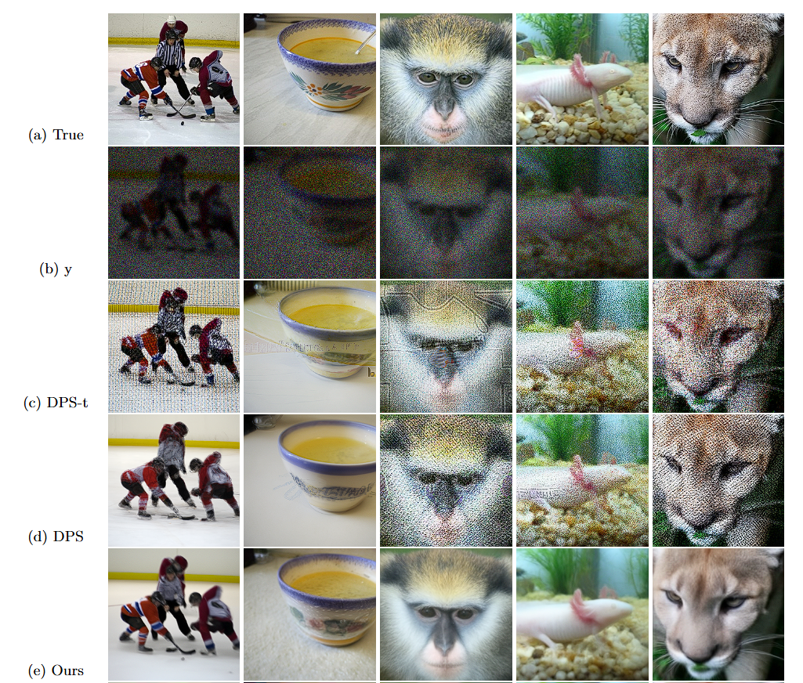
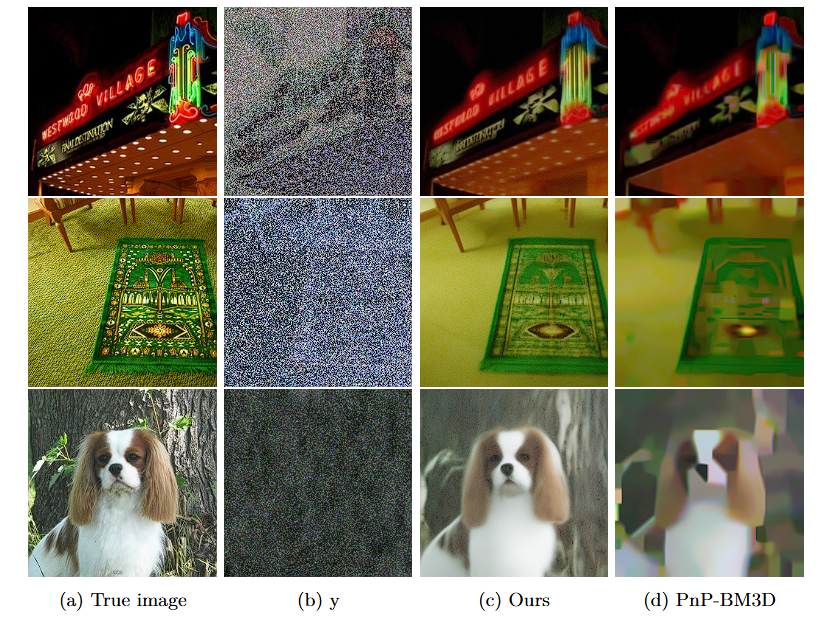

# Score-Based Denoising Diffusion Models for Photon-Starved Image Restoration Problems

Savvas Melidonis, Yiming Xi, Konstantinos C. Zygalakis, Yoann Altmann, Marcelo Pereyra

[[project page](https://github.com/SavvasMel/Prox-DiffPIR)] [[paper](https://openreview.net/forum?id=UYXPt7HUdl)]

This repository contains the code and data associated with the paper 'Score-Based Denoising Diffusion Models for Photon-Starved Image Restoration Problems
'

This code is based on the [OpenAI Guided Diffusion](https://github.com/openai/guided-diffusion), [DPIR](https://github.com/cszn/DPIR) and [DiffPIR](https://yuanzhi-zhu.github.io/DiffPIR).

## Abstract
Score-based denoising diffusion models have recently emerged as a powerful strategy to solve image restoration problems. Early diffusion models required problem-specific training. However, modern approaches can combine a likelihood function that is specified during test-time with a foundational pretrained diffusion model, which is used as an implicit prior in a Plug-and-Play (PnP) manner. This approach has been shown to deliver state-of-the-art performance in a wide range of image restoration problems involving Gaussian and mild Poisson noise. With extreme computer vision applications in mind, this paper presents the first PnP denoising diffusion method for photon-starved imaging problems. These problems arise in new quantum-enhanced imaging systems that exploit the particle nature of light to exceed the limitations of classical imaging. The problems involve highly challenging noise statistics, such as binomial, geometric, and low-intensity Poisson noise, which are difficult because of high uncertainty about the solution and because the models exhibit poor regularity properties (e.g., exploding scores, constraints). The proposed method is demonstrated on a series of challenging photon-starved imaging experiments with as little as 1 photon per pixel, where it delivers remarkably accurate solutions and outperforms alternative strategies from the state-of-the-art.

<p style="text-align: center;">
    
</p>

## Setting Up
### Clone and Install
```bash
git clone https://github.com/SavvasMel/Prox-DiffPIR.git
pip install -r requirements.txt
```

### Model Download
links to model checkpoints can be found in [./model_zoo/README.md](https://github.com/yuanzhi-zhu/DiffPIR/blob/main/model_zoo/README.md)

### Inference Code
```python
python prox_diffpir_poisson.py # Poisson deblurring
python prox_diffpir_binomial.py # Binomial denoising
python prox_diffpir_geometric.py # Geometric inpainting
```

### Train Your Own Diffusion Models
To train a new diffusion model, please follow [OpenAI Guided Diffusion](https://github.com/openai/guided-diffusion).

## Results
### Qualitative Results
<details open>
  <summary>Click to display/hide qualitative results for Poisson deblurring</summary>
<p style="text-align: center;">
    
</p>
  
</details>

<details open>
  <summary>Click to display/hide qualitative results for geometric inpainting</summary>

<p style="text-align: center;">
    
</p>


  
</details>
